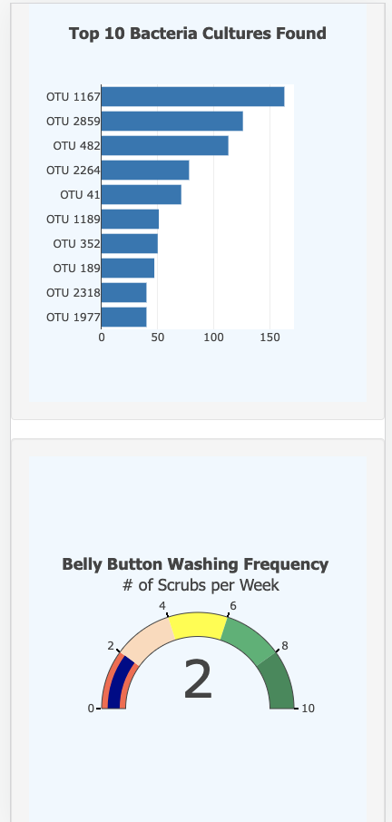

# Plotly_Belly_Button_Biodiversity

## Overview

The project aims to help a biological researcher discover and document unknown bacterial species that can synthesize proteins. Based on the hypothesis that the ideal bacterial species to synthesize proteins may be found in someone’s belly button, the navels of people across the country are sampled. To facilitate the research participants and fellow researchers access the identified bacterial species, a dashboard is created with the below functionalities:
- Retrieve data from external JSON file to perform data manipulations.
  - Load the participants' identity in a dropdown list and render demographic information upon ID selection.
- Create interactive visualizations with Plotly and JavaScript event listeners as below:
  - A dynamic bar chart to display the top 10 bacterial species when an participant’s ID is selected from the dropdown menu.
  - A bubble chart to display the biodiversity and concentration of microroganisms for a selected research participant.
  - The weekly washing frequency and progressive measures for a selected participant as a gauge chart.
- Customize the webpage with HTML and Bootstrap.

## Resources

- Plotly 2.16.1
- JavaScript ES6
- HTML5
- CSS
- D3
- Bootstrap 3.3.7
- Sample data from research participants

## Results

- The dashboard displays participant ID: 940's data in the demographic panel and the three charts when first opened in the browser.

- When another sample is selected, the dashboard displays the data in the panel and all three charts accordingly.

- The webpage is customized as below:
  - An image is added to jumbotron.
  - Information about the project is added as a paragraph on the dashboard.

  - The webpage is mobile responsive. 
  - Bootstrap classes are added to customize charts.

<table>
  <tr>
    <td></td>
    <td></td>
  </tr>
</table>

